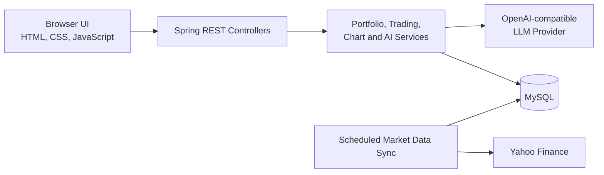

# Spark Portfolio Manager

[](https://github.com/Neueda-Learning/Spark/actions/workflows/ci.yml)


Spark Portfolio Manager is a full-stack investment portfolio application built by
**Team Spark**. It combines portfolio tracking, simulated trading, dividend
accounting, historical market data, interactive charts, and an AI-assisted
investment workspace in one Spring Boot application.

The application is designed as an educational portfolio simulator. Transactions
use the latest available post-close price stored in the database; they are not
connected to a brokerage and do not represent real-time trade execution.

## Features

- **Portfolio dashboard** — monitor total value, cash balance, unrealized profit
  and loss, return rate, paid dividends, and pending dividends.
- **Performance analytics** — explore asset allocation and the last seven trading
  days of portfolio performance.
- **Portfolio operations** — deposit cash and execute validated buy or sell
  transactions.
- **Market catalogue** — browse stocks, bond ETFs, cash instruments, current
  prices, and daily price changes.
- **Candlestick charts** — inspect daily, weekly, and monthly OHLCV history with
  interactive tooltips.
- **Market data synchronization** — backfill and reconcile Yahoo Finance daily
  market data with idempotent database updates.
- **AI investment assistant** — ask portfolio-aware questions through a standard
  or streaming chat endpoint backed by an OpenAI-compatible provider.
- **Ready-to-use sample portfolio** — start with seeded instruments, holdings,
  transactions, dividends, and recent market prices.

## Tech Stack

| Layer | Technology |
| --- | --- |
| Backend | Java 21, Spring Boot 3.3.5, Spring Web |
| Persistence | Spring Data JDBC, MySQL 8 |
| Validation | Jakarta Bean Validation |
| Frontend | HTML, CSS, vanilla JavaScript, Chart.js 4 |
| Market data | Yahoo Finance chart API |
| AI integration | OpenAI-compatible chat completions API |
| Build and test | Maven, JUnit 5, Mockito, GitHub Actions |

## Architecture



The frontend is served from the same Spring Boot process as the REST API. Portfolio
state, transactions, dividends, cached performance, and daily prices are persisted
in MySQL. In the default profile, scheduled jobs keep Yahoo market data current.

## Prerequisites

- JDK 21
- Maven 3.8 or later
- MySQL 8.0 or later
- An API key for an OpenAI-compatible model provider, only if the AI assistant is
  required

## Getting Started

### 1. Clone the repository

```bash
git clone https://github.com/Neueda-Learning/Spark.git
cd Spark
```

### 2. Configure the application

Create a `.env` file in the project root:

```properties
SPRING_DATASOURCE_URL=jdbc:mysql://localhost:3306/portfoliodb?useSSL=false&allowPublicKeyRetrieval=true&createDatabaseIfNotExist=true
SPRING_DATASOURCE_USERNAME=root
SPRING_DATASOURCE_PASSWORD=your-database-password

# Optional: required only for the AI assistant
AI_PROVIDER=openai
AI_CHAT_URL=https://api.openai.com/v1/chat/completions
AI_MODEL=gpt-4o-mini
AI_API_KEY=your-provider-api-key
```

The same settings can be supplied as environment variables. The `.env` file and
its variants are ignored by Git; never commit credentials.

The configured MySQL user must be able to connect to the server and create or
update the application database. Spring Boot automatically applies
`schema.sql` and `data.sql` during startup.

### 3. Run the application

```bash
mvn spring-boot:run
```

Open [http://localhost:8080](http://localhost:8080) in a browser.

### 4. Run the test suite

```bash
mvn test
```

To create the packaged application:

```bash
mvn package
java -jar target/portfolio-manager-1.0.0.jar
```

## Runtime Modes

### Default mode

The default profile reads post-close prices from MySQL and keeps the database
updated through Yahoo Finance:

- startup backfill: up to 60 months of history;
- overlap window: the most recent 10 days;
- post-close sync: 18:30, Monday to Friday, New York time;
- reconciliation sync: 08:00, Monday to Friday, New York time.

Disable startup backfill when needed:

```bash
mvn spring-boot:run \
  -Dspring-boot.run.arguments=--market-data.backfill-on-startup=false
```

### Demo mode

Use deterministic simulated prices instead of the production market-data flow:

```bash
mvn spring-boot:run -Dspring-boot.run.profiles=demo
```

Demo mode still uses MySQL for portfolio persistence.

## Configuration Reference

| Variable | Default | Description |
| --- | --- | --- |
| `SPRING_DATASOURCE_URL` | `jdbc:mysql://localhost:3306/portfoliodb...` | MySQL JDBC connection URL |
| `SPRING_DATASOURCE_USERNAME` | Empty | MySQL username |
| `SPRING_DATASOURCE_PASSWORD` | Empty | MySQL password |
| `AI_PROVIDER` | `qwen` | AI provider label used by the LLM gateway |
| `AI_CHAT_URL` | Configured compatible endpoint | Chat completions endpoint |
| `AI_MODEL` | `qwen-plus` | Provider model name |
| `AI_API_KEY` | Empty | Bearer token for AI requests |
| `AI_MARKET_DATA_MODE` | `internal` | AI context source: `internal` or `yahoo` |

Additional market-data scheduling and backfill settings are available in
[`src/main/resources/application.properties`](src/main/resources/application.properties).

## API Overview

| Method | Endpoint | Description |
| --- | --- | --- |
| `GET` | `/api/portfolio/overview` | Return portfolio totals, returns, allocation, and dividends |
| `GET` | `/api/portfolio/weekly-performance` | Return performance for the latest seven trading days |
| `GET` | `/api/portfolio/holdings` | List current holdings |
| `POST` | `/api/portfolio/deposit` | Add cash to the portfolio |
| `POST` | `/api/portfolio/transactions` | Execute a validated `BUY` or `SELL` transaction |
| `GET` | `/api/stocks` | List all supported instruments with latest prices |
| `GET` | `/api/stocks/{id}` | Return one instrument |
| `GET` | `/api/stocks/{id}/candles` | Return `DAILY`, `WEEKLY`, or `MONTHLY` candles |
| `POST` | `/api/portfolio/ai-assistant/chat` | Request a complete AI response |
| `POST` | `/api/portfolio/ai-assistant/chat/stream` | Stream an AI response as plain text |

Example transaction:

```bash
curl -X POST http://localhost:8080/api/portfolio/transactions \
  -H "Content-Type: application/json" \
  -d '{"stockId":1,"type":"BUY","quantity":2}'
```

Example candlestick request:

```bash
curl "http://localhost:8080/api/stocks/1/candles?interval=WEEKLY&limit=52"
```

## Sample Data

On first startup, the application creates a USD 100,000 sample portfolio with:

- positions in AAPL, MSFT, PG, XOM, AGG, and BND;
- a broader catalogue of US equities, bond ETFs, and cash instruments;
- historical buy transactions and dividend events;
- recent daily OHLCV records so the dashboard can render before a full Yahoo
  backfill finishes.

Seed operations are idempotent, so restarting the application does not duplicate
the initial records.

## Project Structure

```text
.
├── .github/workflows/ci.yml        # Build and test workflow
├── src/main/java/com/portfolio
│   ├── config/                     # HTTP, database, and static-resource config
│   ├── controller/                 # REST API endpoints
│   ├── dto/                        # API request and response contracts
│   ├── model/                      # Domain models
│   ├── repository/                 # JDBC persistence layer
│   ├── scheduler/                  # Market-data jobs and startup backfill
│   └── service/                    # Portfolio, market-data, trading, and AI logic
├── src/main/resources
│   ├── static/index.html           # Browser application
│   ├── application.properties      # Runtime configuration
│   ├── schema.sql                  # MySQL schema
│   └── data.sql                    # Idempotent sample data
└── src/test                        # Unit and integration tests
```

## Important Notes

- This project is for educational and demonstration purposes.
- Market prices are post-close data and may be delayed or unavailable.
- AI-generated output is informational only and is not financial advice.
- Buy and sell operations are simulated and do not place real brokerage orders.

## Team

Built by **Spark**.
