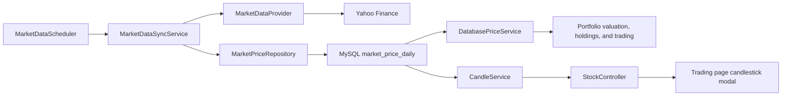

# Yahoo Market Data Ingestion and Multi-Interval Candlestick Plan

## 1. Document Info

- Project: Portfolio Manager
- Status: Implemented, with ongoing enhancements
- Applicable version: Post-V1 incremental releases
- Created: 2026-07-27
- Last updated: 2026-07-28
- This document describes the design, implemented scope, and follow-up enhancement decisions.

## 2. Background

The current V1 already provides:

- Spring Boot REST APIs
- MySQL persistence
- A default portfolio, holdings, and buy/sell transactions
- Portfolio overview, asset allocation, and trading pages
- Deterministic simulated prices via `SimulatedPriceService`

The current pricing flow still has these limitations:

- Stock prices are generated locally in code instead of using real financial data.
- There is no independent historical market data table.
- Price reads depend on runtime calculation and cannot reflect actual trading days.
- Reliable daily, weekly, and monthly price history cannot be produced.
- The `YahooFinanceAPI` dependency already exists, but is not yet used by business code.

This increment keeps the existing V1 portfolio and trading capabilities, adds Yahoo Finance historical data, and shows daily, weekly, and monthly candlestick charts on the trading page.

## 3. Objectives

### 3.1 Functional Goals

1. Fetch real post-close daily OHLCV data from Yahoo Finance.
2. Save daily prices to MySQL with repeatable execution and correction support.
3. Backfill a historical daily price range when the application is first connected.
4. Periodically sync the latest daily prices after the US market close.
5. Read portfolio valuation, holding P&L, and trade reference prices from the latest database close.
6. Provide a unified REST API for daily, weekly, and monthly candles by stock.
7. When the user clicks a stock on the trading page, open a candlestick view that defaults to daily and supports interval switching.
8. When the mouse hovers a candle, show OHLC, adjusted close, change percent, and volume for that interval.
9. If Yahoo is temporarily unavailable, existing historical prices and pages must remain accessible.

### 3.2 Non-Goals

This increment does not include:

- Minute-level or real-time prices
- Real broker execution
- Intraday matching logic
- User-defined market data providers
- Full multi-market trading calendar support
- Technical indicators such as MA, MACD, and RSI
- Scheduled-job coordination across multiple instances
- Automatic handling for every dividend, split, and adjusted-price scenario
- Refactoring or formally wiring in the React frontend at the repo root that is not part of the current build

## 4. Core Design Principles

### 4.1 The Database Is the Source of Truth for Frontend Prices

Yahoo Finance is called only by backend sync tasks. Controllers, portfolio valuation, trading services, and the frontend do not call Yahoo directly.

This approach:

- Reduces page-request latency
- Avoids sudden Yahoo request spikes from user clicks
- Keeps historical prices available when Yahoo is temporarily failing
- Ensures the overview, holdings list, and candles all use the same price set
- Makes testing and future provider replacement easier

### 4.2 Persist Only Daily Bars, Derive Other Intervals on Demand

The database stores daily OHLCV only. Daily candles map directly from daily prices. Weekly and monthly candles are aggregated dynamically from the daily series and are not stored separately.

Weekly aggregation rules:

- `open`: the open of the first trading day of the week
- `high`: the highest high across the week
- `low`: the lowest low across the week
- `close`: the close of the last trading day of the week
- `adjustedClose`: the adjusted close of the last trading day of the week
- `volume`: the sum of weekly volume
- `date`: the Monday of the week, or a consistently defined first trading day of the week

Monthly candles follow the same OHLCV rules grouped by calendar month, and `date` returns the first day of the month. The current unfinished week or month may still be shown, with the response-level `asOf` field indicating the data cutoff date.

### 4.3 Yahoo Access Must Go Through a Replaceable Adapter

Business services must not depend directly on the static `YahooFinance.get(...)` method. Add a `MarketDataProvider` abstraction implemented by `YahooMarketDataProvider`.

If Yahoo becomes unavailable later, another provider can be added without changing the database layer, scheduler, controllers, or frontend.

### 4.4 Synchronization Must Be Idempotent

Each stock and trading day can have only one daily price record. Repeated syncs update existing rows instead of inserting duplicates.

## 5. Overall Architecture



## 6. Database Design

### 6.1 New Table: `market_price_daily`

Recommended structure:

| Field | Suggested Type | Description |
|---|---|---|
| `id` | `BIGINT` | Auto-increment primary key |
| `stock_id` | `BIGINT` | References `stock.id` |
| `trade_date` | `DATE` | Trading date |
| `open_price` | `DECIMAL(18,6)` | Open price |
| `high_price` | `DECIMAL(18,6)` | High price |
| `low_price` | `DECIMAL(18,6)` | Low price |
| `close_price` | `DECIMAL(18,6)` | Close price |
| `adjusted_close` | `DECIMAL(18,6)` | Adjusted close |
| `volume` | `BIGINT` | Volume |
| `source` | `VARCHAR(20)` | Data source, `YAHOO` in v1 |
| `fetched_at` | `TIMESTAMP` | Last fetch time |

Constraints and indexes:

- Foreign key: `stock_id` references `stock(id)`
- Unique constraint: `(stock_id, trade_date)`
- Query index: `(stock_id, trade_date)`
- Use `INSERT ... ON DUPLICATE KEY UPDATE` for idempotent upserts

### 6.2 Whether `stock` Must Change

The first version can leave the `stock` table unchanged:

- Stocks and bond ETFs use the existing `symbol` to query Yahoo.
- `asset_type = 'CASH'` entries such as USD and USDMONEY do not call Yahoo and always keep price 1.

If international markets are added later, consider adding:

- `provider_symbol`
- `price_enabled`
- `market_timezone`

For now, keep the change set small and avoid adding unused fields early.

## 7. Backend Design

### 7.1 Market Data Domain Model

Add:

- `model/MarketPriceDaily.java`

Recommended fields should match the database table and use Java `record`, `LocalDate`, `BigDecimal`, and `Instant` or `LocalDateTime`.

### 7.2 Repository

Add:

- `repository/MarketPriceRepository.java`
- `repository/JdbcMarketPriceRepository.java`

Main responsibilities:

- Batch upsert of daily prices
- Query the last trading day for a stock
- Query daily prices for a stock within a date range
- Query the latest price for a stock
- Query the most recent two price records for a stock
- Query the most recent N trading days for a stock

Network requests must not be placed inside long-running database transactions. Recommended flow:

1. Call Yahoo to fetch data.
2. Transform and validate the result.
3. Open a short transaction for batch writes.
4. Commit and record the sync result.

### 7.3 Market Data Provider

Add:

- `service/marketdata/MarketDataProvider.java`
- `service/marketdata/YahooMarketDataProvider.java`

Responsibilities:

- Fetch daily prices by symbol, start date, and end date
- Convert Yahoo `HistoricalQuote` objects to internal `MarketPriceDaily`
- Handle Yahoo null values and exceptions consistently
- Explicitly convert trading dates using `America/New_York`
- Exclude any database write logic

The existing dependency supports these calls:

```text
YahooFinance.get(symbol, from, to, Interval.DAILY)
HistoricalQuote.getOpen()
HistoricalQuote.getHigh()
HistoricalQuote.getLow()
HistoricalQuote.getClose()
HistoricalQuote.getAdjClose()
HistoricalQuote.getVolume()
```

### 7.4 Data Validation

Before database writes, validate at minimum:

- date, open, high, low, and close are not null
- OHLC values are greater than zero
- `high >= max(open, close)`
- `low <= min(open, close)`
- volume is treated as zero when null and must not be negative when present
- the date is not later than the current eligible trading date
- the symbol can be mapped to a local `stock`

Invalid records should be skipped and logged without causing the sync for other stocks to fail.

### 7.5 Market Data Sync Service

Add:

- `service/MarketDataSyncService.java`
- `service/MarketDataSyncServiceImpl.java`

Responsibilities:

- Find non-CASH instruments that need syncing
- Calculate the sync date range for each instrument
- Call the provider
- Validate and batch upsert
- Isolate failures per stock
- Report synced count, skipped count, and failure reasons

Sync strategy:

- When the table is empty, backfill the most recent 12 to 18 months of daily prices
- When data already exists, fetch again from 7 to 10 calendar days before the last known price date
- Use upsert to apply Yahoo corrections to recent data
- Accept only daily bars from completed regular trading days and never persist an intraday bar for the still-open current day
- Treat weekends and market holidays with no new data as normal and do not insert placeholder rows
- One stock failure must not affect other stocks

The initial recommendation is an 18-month backfill so at least 52 complete weekly candles are available.

### 7.6 Scheduled Jobs

Add:

- `scheduler/MarketDataScheduler.java`

Modify:

- `PortfolioApplication.java` or add a separate scheduling configuration class
- `application.properties` to add non-sensitive scheduling settings

#### 7.6.1 Daily Price Completeness Contract

In this project, a daily price means an OHLCV bar for a completed regular US market session:

- Regular session hours are `09:30-16:00 America/New_York`
- On early-close days the regular session may end at `13:00 America/New_York`
- Daily bars exclude pre-market and after-hours trades
- Every `market_price_daily` row must represent a completed trading day
- The still-changing intraday bar for the current day must never be written as a finalized daily record

The latest allowed date is determined in New York time:

- Runs after 18:30 New York time may accept the completed bar for the current day
- Runs before 18:30 New York time may only accept up to the previous completed trading day
- During historical backfill or intraday startup, even if Yahoo returns same-day data, that record must be discarded until the post-close cutoff has passed
- Weekends and exchange holidays do not generate placeholder rows
- Early-close days still use the normal post-close schedule, so no special cron adjustment is required

This contract ensures portfolio valuation, trade reference prices, daily bars, and weekly candles all depend only on complete, stable trading-day data.

#### 7.6.2 Post-Close Primary Sync

The post-close primary sync fetches the completed bar for the current day. Recommended default configuration:

```text
cron: 0 30 18 * * MON-FRI
zone: America/New_York
```

Meaning: run at 18:30 New York time on each US trading weekday.

The schedule is intentionally 2.5 hours after the close instead of immediately after 16:00, to leave time for closing auctions, data consolidation, and Yahoo updates.

Approximate Beijing-time equivalents:

- US daylight saving time: 06:30 the next day
- US standard time: 07:30 the next day

The implementation must use `America/New_York` explicitly. Do not hard-code Beijing time, or DST changes will shift the schedule incorrectly.

#### 7.6.3 Pre-Market Reconciliation Sync

The pre-market reconciliation sync fills gaps and accepts data corrections, but does not collect pre-market real-time quotes. Recommended default configuration:

```text
cron: 0 0 8 * * MON-FRI
zone: America/New_York
```

Meaning: resync the most recent 7 to 10 calendar days at 08:00 New York time on each US trading weekday.

Purpose:

- Recover if Yahoo was temporarily unavailable the prior day
- Accept corrections to the previous trading day from Yahoo
- Recover from application downtime or primary job failure
- Refill the database before the next market open where possible

The pre-market reconciliation job and the post-close primary job both call the same idempotent sync service. The unique constraint and upsert behavior guarantee repeated execution will not create duplicate rows.

#### 7.6.4 Sync Window and Catch-Up Strategy

Daily jobs should not request only “today”. They should use an overlap window:

```text
start date = last trading date in the database - 10 calendar days
end date = latest allowed writable trading date
```

This handles the following without requiring a full US trading calendar implementation:

- weekends and holidays
- application downtime
- temporary Yahoo failures
- recent data corrections
- missed post-close sync runs

The initial historical backfill may be run explicitly at any time, but it must still obey the completed-bar filter and must not save a current-day bar before the session has closed.

Final timeliness contract:

> Under normal conditions, the completed daily bar for the current day should be stored after the 18:30 New York post-close sync. If that sync fails, the next 08:00 New York reconciliation sync or a later overlap window should fill the gap.

#### 7.6.5 Configuration Keys

Externalize the cron values and switches:

```text
market-data.sync.enabled
market-data.sync.post-close-cron
market-data.sync.reconciliation-cron
market-data.sync.zone
market-data.sync.close-cutoff
market-data.backfill-months
market-data.overlap-days
```

These settings must not include secrets. If a future provider requires an API key, it must be supplied through environment variables and must not be committed to the repository.

#### 7.6.6 Compatibility Evaluation with the V1 Time Model

V1 currently has no scheduled jobs and does not explicitly set a global JVM, Jackson, or MySQL timezone. Existing time handling includes:

- transactions use `LocalDateTime.now()` for `createdAt`, meaning local application runtime time
- `portfolio.created_at` and `transaction.created_at` use MySQL `TIMESTAMP` and are read back as zone-less `LocalDateTime`
- simulated prices use server-local `LocalDate.now()` to build seven-day dates
- `portfolio_snapshot.snapshot_date` uses `DATE/LocalDate`, but snapshot generation is not currently active
- exception responses use `Instant.now()`, which yields a UTC instant

Because of that, adding New York time for market-data logic does not inherently conflict with V1, as long as New York time is scoped only to price synchronization and market business dates rather than changing the global application time environment.

The following isolation rules must be respected:

1. `@Scheduled` should control trigger time only through `zone = "America/New_York"`.
2. When calculating the price cutoff date, explicitly use `ZoneId.of("America/New_York")`.
3. When converting a Yahoo `Calendar` to a trading date, explicitly convert to the New York market timezone before extracting `LocalDate`.
4. `market_price_daily.trade_date` must use `DATE/LocalDate` to represent a market business date, not a timestamp.
5. `market_price_daily.fetched_at` should preferably use `Instant` in Java to represent an absolute fetch time.
6. Do not call `TimeZone.setDefault(...)`.
7. Do not add a global `-Duser.timezone=America/New_York`.
8. Do not change `spring.jackson.time-zone` or the MySQL global or session timezone for the price sync feature.
9. Keep the V1 semantics of `transaction.createdAt` and `portfolio.createdAt` unchanged and do not compare them directly with `trade_date`.
10. If `portfolio_snapshot` generation is added later, its `snapshot_date` must use the New York market business date to align with daily prices.

Inject a replaceable `Clock` into the market sync logic instead of calling system time directly. In production the clock should use the New York timezone. In tests use a fixed clock to verify:

- Shanghai has moved to the next calendar day while New York is still on the previous one
- behavior before and after the 18:30 ET cutoff
- US daylight saving transitions
- weekends, exchange holidays, and early-close days
- when the app itself runs outside New York, scheduling and trading dates still remain correct

The API must distinguish between two time semantics:

- `priceDate`, `asOf`: New York market business date, returned as `YYYY-MM-DD`
- `fetchedAt`: absolute timestamp, returned in ISO-8601 with `Z` or an offset
- `transaction.createdAt`: existing V1 local datetime, unchanged for now, and the UI must not label it as New York time

Compatibility conclusion:

> Using a scoped New York market timezone does not affect V1. Changing the global JVM, Jackson, or database timezone could alter existing transaction and creation-time semantics and is explicitly forbidden in this implementation.

### 7.7 Database Price Service

Add:

- `service/DatabasePriceService.java`

Gradually replace the production responsibility of `SimulatedPriceService`:

- `getCurrentPrice`: return the close price for the latest trading day
- `getChangePercent`: compare the close prices of the two most recent trading days
- historical prices: query from `market_price_daily`

`SimulatedPriceService` should remain available only for the `demo` and `test` profiles and must not silently act as a production fallback. If real prices are unavailable, the system should explicitly return `market data unavailable` or show a missing-data state so users do not mistake simulated prices for real ones.

Recommended additions to price responses:

- `priceDate`
- `priceSource`
- `stale`

The trading page should clearly state that order calculations use the latest available post-close price, not a live market execution price.

## 8. Multi-Interval Candles API

### 8.1 Unified Endpoint

The API supports daily, weekly, and monthly intervals:

```http
GET /api/stocks/{id}/candles?interval=DAILY&limit=120
GET /api/stocks/{id}/candles?interval=WEEKLY&limit=52
GET /api/stocks/{id}/candles?interval=MONTHLY&limit=60
```

If `interval` is omitted, the default is `DAILY`. If `limit` is omitted, use interval-specific defaults:

| interval | default count | max count |
|---|---:|---:|
| `DAILY` | 120 | 260 |
| `WEEKLY` | 52 | 104 |
| `MONTHLY` | 60 | 120 |

The API reads only from the database and never calls Yahoo during a user request.

The old hover-based seven-day line chart and its `GET /api/stocks/{id}/prices` endpoint are no longer retained.

### 8.2 Example Response

```json
{
  "stockId": 1,
  "symbol": "AAPL",
  "interval": "DAILY",
  "source": "YAHOO",
  "asOf": "2026-07-24",
  "candles": [
    {
      "date": "2026-07-24",
      "open": 210.10,
      "high": 218.20,
      "low": 208.40,
      "close": 216.75,
      "adjustedClose": 216.75,
      "volume": 305000000
    }
  ]
}
```

### 8.3 New DTOs and Services

Add:

- `dto/CandleResponse.java`
- `dto/CandleSeriesResponse.java`
- `service/CandleInterval.java`
- `service/CandleService.java`
- `service/CandleServiceImpl.java`

Modify:

- `controller/StockController.java`

### 8.4 Where to Aggregate Intervals

Aggregation should happen in a Java service instead of complex MySQL SQL.

Reasons:

- selecting the first and last trading day is easier to do correctly
- holidays are easier to handle
- incomplete trading weeks are easier to handle
- aggregation logic can be verified with pure unit tests
- daily, weekly, and monthly intervals can share the same accumulator and response model

Conversion rules:

- `DAILY`: map each daily price directly to `CandleResponse`
- `WEEKLY`: aggregate using Monday as the interval key
- `MONTHLY`: aggregate by the first day of each calendar month
- return results sorted by date ascending and trim to the latest `limit` entries
- the current unfinished week or month may still be returned, with the top-level `asOf` indicating the cutoff date

## 9. Frontend Design

### 9.1 Change Target

The actual runtime frontend is:

- `src/main/resources/static/index.html`

This change does not modify the React/TypeScript sources at the repo root that are not part of the current build pipeline, avoiding divergence between two unsynchronized implementations.

### 9.2 Interaction

Both tables on the trades page support row clicks:

- My Holdings
- Market Securities

When a stock row is clicked:

1. Open a candlestick modal or right-side drawer.
2. Show the stock symbol, name, selected interval, and data cutoff date.
3. Show `Daily | Weekly | Monthly` tabs at the top, defaulting to Daily.
4. Show a loading state and request the candles API for the selected interval.
5. Draw the candlestick chart with Canvas.
6. Show a detailed tooltip for the hovered candle.
7. Support close, stock switching, and interval switching.
8. Show request errors inside the modal without affecting the rest of the page.

Trading buttons must stop event propagation:

```text
Buy/Sell button click -> stopPropagation
```

Otherwise clicking Buy or Sell would also open the candlestick view.

### 9.3 Chart Implementation

The current implementation uses native Canvas to draw candlesticks and does not add a third-party charting library or CDN dependency.

Interval switching should reuse the same Canvas rendering flow. The tooltip should locate the corresponding candle from the Canvas X coordinate and show a detailed absolutely positioned DOM tooltip inside the chart container. This keeps rendering fast while preserving full control over tooltip content and edge handling.

### 9.4 Frontend State

Recommended additions:

- current selected stock
- current interval, reset to `DAILY` when the modal opens
- candle data
- loading
- error
- current Canvas layout info for mouse hit testing
- current request controller

When switching stock, switching interval, or closing the modal:

- cancel any unfinished request
- clear the old chart and tooltip
- clear the old error
- prevent slower old requests from overwriting newer stock or interval state

### 9.5 Tooltip

The tooltip should show:

- date or interval label
- open, high, low, close
- adjusted close
- absolute and percentage change relative to the open
- volume

Hide the tooltip when the mouse leaves the plotting area, when switching interval, resizing the window, or closing the modal. The tooltip should automatically flip away from chart edges to stay inside the modal.

## 10. Error Handling and Degradation

### 10.1 Yahoo Request Failures

- catch exceptions per stock
- retry only a limited number of times
- use exponential backoff
- never delete historical prices already stored in the database
- log the symbol, date range, and failure category
- never log cookies, tokens, or other sensitive data

### 10.2 Stale Data

If the latest price is too old relative to the current date:

- the stock list should show `Data as of YYYY-MM-DD`
- return `stale = true`
- the overview may still use the last known price, but should indicate the data may be stale
- whether trading is blocked is a product decision; the recommended first version warns instead of blocking

### 10.3 No Historical Data

- the candles API returns an empty list or a clear 404/business error
- the frontend shows `No historical market data`
- never silently generate simulated candles

### 10.4 CASH Instruments

- USD and USDMONEY do not request Yahoo
- current price stays fixed at 1
- clicking a CASH instrument can hide the candlestick entry point or show `Not applicable`

The recommended first version is not to bind candlestick click behavior to CASH rows.

## 11. Test Strategy

### 11.1 Provider Tests

- field mapping from Yahoo `HistoricalQuote` to the internal model
- timezone conversion
- null fields and invalid OHLC values
- Yahoo returning an empty list
- Yahoo throwing `IOException`

Because the Yahoo API entry point is a static method, keep that static call isolated inside the adapter and mock only `MarketDataProvider` in business-level tests.

### 11.2 Sync Service Tests

- empty table triggers historical backfill
- incremental sync uses the lookback overlap window
- same-day bars are filtered out before 18:30 ET
- completed same-day bars are allowed after 18:30 ET
- intraday startup does not save a temporary same-day bar
- post-close and pre-market jobs both invoke the same idempotent service
- weekends and market holidays with no new data still complete successfully
- early-close days still persist complete daily bars in the post-close job
- when the JVM runs in `Asia/Shanghai`, trading dates are still calculated using New York market dates
- when Shanghai is on the next day but New York is not, `trade_date` is still correct
- DST transitions do not alter scheduling semantics
- price sync does not change the existing semantics of V1 `transaction.createdAt`
- CASH instruments never call the provider
- duplicate data goes through upsert
- one stock failure does not affect the others
- invalid data never reaches the database

### 11.3 Multi-Interval Candle Tests

- daily prices map directly and return in ascending date order
- normal five-trading-day week
- Monday holiday
- Friday holiday
- week with only one trading day
- week crossing the year boundary
- current incomplete week
- weekly volume is summed correctly
- cross-month data is grouped correctly
- monthly OHLC and volume are computed correctly
- current incomplete month
- results are returned in ascending date order

### 11.4 Controller Tests

- omitting `interval` returns 120 daily candles by default
- weekly and monthly candles return normally
- stock does not exist
- unsupported interval
- `limit` outside the allowed bounds
- no historical data
- service exception error response

### 11.5 Repository / Integration Tests

Prioritize verification of:

- unique constraint
- MySQL upsert behavior
- order of the latest-two-price query
- date-range queries
- batch writes

If time permits, use Testcontainers MySQL. If not, at least run one end-to-end sync verification against a development database.

### 11.6 Frontend Acceptance

- clicking a holding row opens the correct stock
- clicking a market row opens the correct stock
- clicking Buy or Sell does not open the candlestick view
- the modal defaults to Daily
- Daily, Weekly, and Monthly tabs switch correctly
- fast interval switching does not show stale request data
- hovered tooltip data matches the API response
- the tooltip does not overflow at chart edges
- fast stock switching does not show mismatched data
- empty data, request failures, and loading states render correctly
- the chart works across different window widths
- closing the modal leaves no stale chart or event handlers behind

## 12. Expected File Changes

### 12.1 Existing Files to Modify

- `pom.xml`: confirm Yahoo dependency and decide whether to add Testcontainers based on the test strategy
- `src/main/java/com/portfolio/PortfolioApplication.java`: enable scheduling or add a separate configuration class
- `src/main/java/com/portfolio/controller/StockController.java`: add the candles API
- `src/main/java/com/portfolio/service/PriceService.java`: extend as needed for data date/source support
- `src/main/java/com/portfolio/service/SimulatedPriceService.java`: limit usage to the `demo` and `test` profiles
- `src/main/java/com/portfolio/dto/StockInfoResponse.java`: add price date, source, and stale
- `src/main/resources/schema.sql`: add the daily market data table
- `src/main/resources/application.properties`: add non-sensitive sync settings
- `src/main/resources/static/index.html`: add row-click behavior, candlestick modal, and chart rendering
- `README.md`: add market data sync, initialization, and run instructions

### 12.2 New Files to Add

- `src/main/java/com/portfolio/model/MarketPriceDaily.java`
- `src/main/java/com/portfolio/repository/MarketPriceRepository.java`
- `src/main/java/com/portfolio/repository/JdbcMarketPriceRepository.java`
- `src/main/java/com/portfolio/service/marketdata/MarketDataProvider.java`
- `src/main/java/com/portfolio/service/marketdata/YahooMarketDataProvider.java`
- `src/main/java/com/portfolio/service/MarketDataSyncService.java`
- `src/main/java/com/portfolio/service/MarketDataSyncServiceImpl.java`
- `src/main/java/com/portfolio/service/DatabasePriceService.java`
- `src/main/java/com/portfolio/service/CandleInterval.java`
- `src/main/java/com/portfolio/service/CandleService.java`
- `src/main/java/com/portfolio/service/CandleServiceImpl.java`
- `src/main/java/com/portfolio/scheduler/MarketDataScheduler.java`
- `src/main/java/com/portfolio/dto/CandleResponse.java`
- `src/main/java/com/portfolio/dto/CandleSeriesResponse.java`
- corresponding test files

## 13. Phased Implementation Plan

### Phase 0: Yahoo Availability Validation

- Fetch one year of DAILY data for AAPL and AGG
- Verify OHLCV fields, trading dates, and request stability
- Confirm the current network environment can reach Yahoo
- Record failure types and average response times

Deliverable: decide whether to continue with the existing YahooFinanceAPI or switch to another provider implementation.

### Phase 1: Daily Price Persistence

- Add the database table
- Implement the model, repository, and provider
- Implement historical backfill and idempotent upsert
- Complete core unit tests

Deliverable: the database contains the latest 12 to 18 months of daily prices for at least 18 non-CASH instruments.

### Phase 2: Database Price Takeover

- Read database prices for the stock list, holdings, and overview
- Add price date, source, and stale indicators
- Keep simulated prices under the `demo` profile

Deliverable: all original V1 features use one consistent set of real post-close prices.

### Phase 3: Multi-Interval Candles API

- Implement daily mapping, weekly aggregation, and monthly aggregation
- Implement the candles API
- Complete aggregation and controller tests

Deliverable: the API returns daily, weekly, and monthly candles through one endpoint with interval-specific defaults and limits.

### Phase 4: Frontend Multi-Interval Candle Interaction

- Draw candlesticks with native Canvas
- Add the modal, interval tabs, and tooltip
- Bind stock row clicks
- Handle button bubbling, loading, errors, stock switching, interval switching, and request cancellation

Deliverable: clicking a stock on the trades page opens daily candles by default, with weekly/monthly switching and hover details.

### Phase 5: Scheduled Jobs and Documentation

- Enable the 18:30 New York post-close primary sync
- Enable the 08:00 New York pre-market reconciliation sync
- Implement complete daily-bar cutoff filtering
- Verify behavior on weekends, holidays, early-close days, and intraday startup
- Verify correct New York market dates even when the app runs in the Shanghai timezone
- Confirm there are no changes to the global JVM, Jackson, or MySQL timezone
- Add configuration keys
- Complete manual end-to-end testing
- Update the README and demo notes

Deliverable: the system writes complete daily bars after market close, backfills gaps automatically before the next market open, and clearly shows the data cutoff time.

## 14. Acceptance Criteria

### 14.1 Data Acceptance

- At least 18 non-CASH instruments complete historical backfill
- No duplicate rows exist for the same stock and trading date
- Repeated syncs do not increase duplicate records
- The latest price date matches the latest available trading day
- Before 18:30 New York time, the current day's intraday bar is never written as a daily record
- When the post-close primary sync succeeds, the completed same-day daily bar is stored after 18:30 ET
- The pre-market reconciliation sync can fill data missed by a prior failure or skipped run
- Weekends and market holidays do not generate placeholder rows and do not cause business-level task failures
- OHLCV values are reasonably consistent with spot checks against Yahoo pages
- A Yahoo failure for one stock does not affect other instruments

### 14.2 API Acceptance

- the candles API returns the latest 120 daily candles for a stock by default
- `interval` switches correctly between `DAILY`, `WEEKLY`, and `MONTHLY`
- `limit` uses interval defaults and enforces caps
- each candle respects the OHLC aggregation rules
- dates are returned in ascending order
- missing stock, missing data, and invalid parameters return explicit responses
- the API never calls Yahoo during a request

### 14.3 Frontend Acceptance

- clicking a stock row opens the correct candlestick view with Daily as the default
- Daily, Weekly, and Monthly tabs switch correctly
- hovering any candle shows the corresponding tooltip data
- Buy and Sell behavior remains unchanged
- the data cutoff date is visible
- request failures do not crash the page
- closing or switching stock does not leave stale charts behind
- CASH instruments do not incorrectly show stock candlesticks

### 14.4 Regression Acceptance

- the existing 17 tests continue to pass
- the portfolio overview, holdings list, and trading features remain usable
- rules such as insufficient cash for buy and insufficient holdings for sell remain unchanged
- the existing behavior of the default `portfolio_id = 1` portfolio is preserved

## 15. Risks and Mitigations

| Risk | Impact | Mitigation |
|---|---|---|
| Yahoo is unofficial and may change | sync failure | isolate the provider, preserve old data, use limited retries, support provider replacement |
| request rate limits | some instruments fail | use small batch calls, run only after close and before open, use overlap windows, avoid frontend direct calls |
| application downtime misses jobs | data gaps | pre-market reconciliation plus 7 to 10 day lookback sync |
| intraday data written as finalized daily bars | unstable valuation and candles | use New York time and 18:30 cutoff, accept completed trading days only |
| holidays produce no new prices | false task-failure signals | treat no new records as normal |
| timezone conversion errors | date shifts and wrong weekly grouping | always use `America/New_York` |
| changing global timezones breaks V1 | altered transaction and creation-time semantics | scope New York time only to scheduler, clock, and market dates; never change global timezone |
| simulated and real prices get mixed | user confusion | forbid silent fallback and include source/asOf/stale in responses |
| Canvas hit testing drifts after scaling | tooltip maps to the wrong candle | store logical plot size and convert mouse coordinates using the real Canvas scale |
| multi-instance duplicate execution | repeated Yahoo requests | rely on database upsert in V1; add distributed locking later if needed |

## 16. Decisions Still to Confirm

Before implementation, the team should confirm:

1. Whether the current unfinished week and month should be displayed
2. Whether stale market data should only warn or also block trading
3. Whether candles should use raw OHLC or adjusted OHLC
4. Whether initial historical backfill should run automatically on startup or only via an explicit command
5. Whether Testcontainers MySQL should be introduced in this phase

Recommended first-version choices:

- default to the latest 120 daily candles, 52 weekly candles, and 60 monthly candles
- show the current incomplete week and month together with `asOf`
- warn on stale data but do not block trading
- remove the old hover chart and seven-day price endpoint
- display raw OHLC while still storing adjusted close
- trigger initial backfill through explicit configuration
- if time allows, add Testcontainers; otherwise complete one development-database end-to-end verification

## 17. External References

- YahooFinanceAPI project: <https://github.com/sstrickx/yahoofinance-api>
- YahooFinanceAPI releases: <https://github.com/sstrickx/yahoofinance-api/releases>
- Yahoo interface change issue: <https://github.com/sstrickx/yahoofinance-api/issues/209>
- NYSE trading hours and holiday calendar: <https://www.nyse.com/trade/hours-calendars>
- Spring Scheduling: <https://docs.spring.io/spring-framework/reference/integration/scheduling.html>
