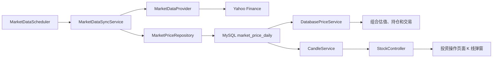

# Yahoo 金融数据入库与多周期 K 线功能改动方案

## 1. 文档信息

- 项目：Portfolio Manager
- 文档状态：已实施，持续增强
- 适用版本：V1 后续增量版本
- 编写日期：2026-07-27
- 最近更新：2026-07-28
- 本文档描述设计、已实施范围和后续增强决策

## 2. 背景

当前 V1 已实现：

- Spring Boot REST API；
- MySQL 持久化；
- 默认投资组合、持仓和买卖交易；
- 组合总览、资产分配和投资操作页面；
- 基于 `SimulatedPriceService` 的确定性模拟行情；

当前行情存在以下限制：

- 股票价格由代码本地生成，不是真实金融数据；
- 价格没有独立的历史行情表；
- 页面请求价格时依赖运行时计算，无法反映真实交易日；
- 无法形成可靠的日线、周线等历史行情；
- `YahooFinanceAPI` 依赖已经存在，但尚未在业务代码中使用。

本次增量希望在保留 V1 组合与交易能力的基础上，引入 Yahoo Finance 历史行情，并在投资操作页面中展示日、周、月三个周期的股票 K 线。

## 3. 建设目标

### 3.1 功能目标

1. 从 Yahoo Finance 获取真实的每日盘后 OHLCV 数据。
2. 将日行情保存到 MySQL，并支持重复执行和数据修正。
3. 在应用首次接入时回填一段历史日线数据。
4. 在美股盘后定期同步最新日行情。
5. 组合估值、持仓盈亏和交易参考价从数据库最新收盘价读取。
6. 提供按股票查询日、周、月 K 线的统一 REST API。
7. 用户点击投资操作页面中的某只股票时，弹出 K 线图，默认显示日线并支持周期切换。
8. 鼠标悬浮在某根 K 线上时显示该周期的 OHLC、复权收盘价、涨跌幅和成交量。
9. Yahoo 暂时不可用时，已有历史行情和页面仍然可访问。

### 3.2 非目标

本次暂不实现：

- 分钟级或实时行情；
- 真实券商交易；
- 盘中成交价撮合；
- 用户自定义行情提供商；
- 多市场交易日历的完整支持；
- 技术指标计算，例如 MA、MACD、RSI；
- 多实例定时任务协调；
- 自动处理所有分红、拆股和复权场景；
- 重构或正式接入仓库根目录下尚未构建的 React 前端。

## 4. 核心设计原则

### 4.1 数据库是页面行情的事实来源

Yahoo Finance 只由后台同步任务调用。Controller、组合估值、交易服务和前端页面均不直接调用 Yahoo。

这样可以：

- 降低页面请求延迟；
- 避免用户点击造成 Yahoo 请求突发；
- 在 Yahoo 暂时失败时继续展示历史数据；
- 保证组合总览、持仓列表和 K 线使用同一份价格；
- 便于测试和后续替换行情提供商。

### 4.2 只持久化日线，多周期 K 线按需派生

数据库只保存每日 OHLCV。日 K 线直接映射日行情；周 K 和月 K 均由日线动态聚合，不单独持久化。

周线聚合规则：

- `open`：该周第一个交易日的开盘价；
- `high`：该周所有交易日的最高价；
- `low`：该周所有交易日的最低价；
- `close`：该周最后一个交易日的收盘价；
- `adjustedClose`：该周最后一个交易日的复权收盘价；
- `volume`：该周成交量之和；
- `date`：该周周一，或统一定义为该周第一个交易日。

月线使用相同的 OHLCV 规则，按自然月分组，`date` 统一返回该月第一天。当前未结束的周和月允许展示，并通过响应顶层 `asOf` 标明数据截止日期。

### 4.3 Yahoo 调用必须通过可替换适配器

业务服务不得直接依赖 `YahooFinance.get(...)` 静态方法。新增 `MarketDataProvider` 抽象，由 `YahooMarketDataProvider` 实现。

未来如果 Yahoo 不可用，可以新增其他 Provider，而无需修改数据库、调度、Controller 或前端。

### 4.4 同步必须幂等

同一只股票、同一交易日只能有一条日行情。重复同步时更新已有数据，不插入重复记录。

## 5. 总体架构



## 6. 数据库设计

### 6.1 新增表 `market_price_daily`

建议结构：

| 字段 | 类型建议 | 说明 |
|---|---|---|
| `id` | `BIGINT` | 自增主键 |
| `stock_id` | `BIGINT` | 关联 `stock.id` |
| `trade_date` | `DATE` | 交易日期 |
| `open_price` | `DECIMAL(18,6)` | 开盘价 |
| `high_price` | `DECIMAL(18,6)` | 最高价 |
| `low_price` | `DECIMAL(18,6)` | 最低价 |
| `close_price` | `DECIMAL(18,6)` | 收盘价 |
| `adjusted_close` | `DECIMAL(18,6)` | 复权收盘价 |
| `volume` | `BIGINT` | 成交量 |
| `source` | `VARCHAR(20)` | 数据源，第一版为 `YAHOO` |
| `fetched_at` | `TIMESTAMP` | 最后抓取时间 |

约束与索引：

- 外键：`stock_id` 引用 `stock(id)`；
- 唯一约束：`(stock_id, trade_date)`；
- 查询索引：`(stock_id, trade_date)`；
- 使用 `INSERT ... ON DUPLICATE KEY UPDATE` 完成幂等 upsert。

### 6.2 是否修改 `stock` 表

第一版可以不修改 `stock` 表：

- 股票和债券 ETF 使用现有 `symbol` 查询 Yahoo；
- `asset_type = 'CASH'` 的 USD、USDMONEY 不调用 Yahoo，价格固定为 1。

如果后续支持国际市场，建议再增加：

- `provider_symbol`；
- `price_enabled`；
- `market_timezone`。

本次优先保持改动小，不提前增加未使用字段。

## 7. 后端设计

### 7.1 行情领域模型

新增：

- `model/MarketPriceDaily.java`

建议字段与数据库表一致，使用 Java `record`、`LocalDate`、`BigDecimal` 和 `Instant`/`LocalDateTime`。

### 7.2 Repository

新增：

- `repository/MarketPriceRepository.java`
- `repository/JdbcMarketPriceRepository.java`

主要方法：

- 批量 upsert 日行情；
- 查询某只股票最后一个交易日；
- 查询某只股票指定日期范围内的日行情；
- 查询某只股票最新一条行情；
- 查询某只股票最近两条行情；
- 查询某只股票最近 N 个交易日。

网络请求不能放在长数据库事务内。建议流程为：

1. 调用 Yahoo 获取数据；
2. 完成转换和校验；
3. 开启短事务批量写入；
4. 提交并记录同步结果。

### 7.3 行情 Provider

新增：

- `service/marketdata/MarketDataProvider.java`
- `service/marketdata/YahooMarketDataProvider.java`

职责：

- 根据 symbol、开始日期和结束日期获取每日行情；
- 将 Yahoo `HistoricalQuote` 转为内部 `MarketPriceDaily`；
- 统一处理 Yahoo 返回的空值和异常；
- 显式使用 `America/New_York` 转换交易日期；
- 不包含数据库写入逻辑。

本地依赖支持的调用能力包括：

```text
YahooFinance.get(symbol, from, to, Interval.DAILY)
HistoricalQuote.getOpen()
HistoricalQuote.getHigh()
HistoricalQuote.getLow()
HistoricalQuote.getClose()
HistoricalQuote.getAdjClose()
HistoricalQuote.getVolume()
```

### 7.4 数据校验

写入数据库前至少校验：

- 日期、open、high、low、close 不为空；
- OHLC 大于零；
- `high >= max(open, close)`；
- `low <= min(open, close)`；
- volume 为空时按零处理，非空时不得小于零；
- 日期不得晚于当前交易日期；
- symbol 必须能映射到本地 `stock`。

无效记录跳过并写日志，不应导致其他股票同步失败。

### 7.5 行情同步服务

新增：

- `service/MarketDataSyncService.java`
- `service/MarketDataSyncServiceImpl.java`

职责：

- 找出需要同步的非 CASH 标的；
- 计算每只标的的同步日期范围；
- 调用 Provider；
- 校验并批量 upsert；
- 按股票隔离失败；
- 输出同步数量、跳过数量和失败原因。

同步策略：

- 表为空时，回填最近 12 至 18 个月日线；
- 已有数据时，从最后行情日期向前回退 7 至 10 个自然日重新拉取；
- 使用 upsert 覆盖 Yahoo 对最近数据的修正；
- 只接受已经结束的常规交易日日线，不保存盘中仍在变化的当天数据；
- 周末和休市日没有新数据属于正常结果，不生成空行情记录；
- 一只股票失败不影响其他股票。

初始默认建议回填 18 个月，以支持至少 52 根完整周 K。

### 7.6 定时任务

新增：

- `scheduler/MarketDataScheduler.java`

修改：

- `PortfolioApplication.java` 或新增 Scheduling 配置类；
- `application.properties` 增加非敏感调度配置。

#### 7.6.1 日行情完整性契约

本项目中的“每日行情”特指美股常规交易时段完成后的日线 OHLCV：

- 常规交易时段为 `09:30-16:00 America/New_York`；
- 提前收盘日的常规交易时段可能在 `13:00 America/New_York` 结束；
- 日线不包含盘前和盘后成交；
- 数据库中的每一条 `market_price_daily` 都必须代表一个已经结束的交易日；
- 不允许将盘中仍在变化的当天行情写成正式日线。

允许写入的最后日期按纽约时间判断：

- 纽约时间 18:30 之后执行：允许接收当天已经完成的日线；
- 纽约时间 18:30 之前执行：最多接收到上一个已完成交易日；
- 历史回填或应用盘中启动时，即使 Yahoo 返回当天数据，也必须丢弃尚未达到盘后截止时间的当天记录；
- 周末和交易所休市日不写入占位记录；
- 提前收盘日仍按正常盘后任务时间执行，因此不需要单独调整 cron。

这项契约的目标是保证组合估值、交易参考价、日线和周 K 线都只依赖完整、稳定的交易日数据。

#### 7.6.2 盘后主同步

盘后主同步负责获取当天已经完成的日线，默认配置：

```text
cron: 0 30 18 * * MON-FRI
zone: America/New_York
```

含义：每个美股工作日纽约时间 18:30 执行。

选择收盘后 2.5 小时，而不是 16:00 后立即执行，是为了给收盘集合竞价、数据整理和 Yahoo 更新留出缓冲时间。

对应北京时间大致为：

- 美国夏令时：次日 06:30；
- 美国冬令时：次日 07:30。

实现中必须使用 `America/New_York`，不能写死北京时间，否则夏令时切换会造成任务时间偏移。

#### 7.6.3 盘前补偿同步

盘前补偿同步用于补漏和接受数据修正，不采集盘前实时行情，默认配置：

```text
cron: 0 0 8 * * MON-FRI
zone: America/New_York
```

含义：每个美股工作日纽约时间 08:00 重新同步最近 7 至 10 个自然日。

作用：

- 补偿前一天 Yahoo 暂时不可用；
- 接受 Yahoo 对上一交易日数据的修正；
- 补偿应用停机或主任务执行失败；
- 尽量在下一次开盘前补齐数据库。

盘前补偿任务和盘后主任务调用同一个幂等同步服务。唯一约束与 upsert 保证重复执行不会产生重复行情。

#### 7.6.4 同步窗口与追赶策略

日常任务不只请求“今天”，而是使用重叠窗口：

```text
开始日期 = 数据库最后交易日 - 10 个自然日
结束日期 = 当前允许写入的最后日期
```

这样可以在不完整实现美国交易日历的情况下处理：

- 周末和节假日；
- 应用停机；
- Yahoo 短暂失败；
- 最近行情修正；
- 盘后主任务遗漏。

首次历史回填可以在任意时间显式执行，但同样必须遵守“完整日线”过滤规则，不能保存当前尚未收盘的日线。

最终数据时效约定：

> 正常情况下，当日完整日线应在纽约时间 18:30 的盘后主同步后入库；若主同步失败，应由下一次纽约时间 08:00 的盘前补偿同步或后续重叠窗口补齐。

#### 7.6.5 配置项

建议把 cron 和开关外部化：

```text
market-data.sync.enabled
market-data.sync.post-close-cron
market-data.sync.reconciliation-cron
market-data.sync.zone
market-data.sync.close-cutoff
market-data.backfill-months
market-data.overlap-days
```

这些配置不包含密钥。若未来接入需要 API Key 的数据源，必须使用环境变量，不得提交到仓库。

#### 7.6.6 与 V1 时间实现的兼容性评估

V1 当前没有定时任务，也没有显式设置 JVM、Jackson 或 MySQL 全局时区。已有时间处理包括：

- 交易流水通过 `LocalDateTime.now()` 生成 `createdAt`，语义是应用运行环境的本地时间；
- `portfolio.created_at` 和 `transaction.created_at` 使用 MySQL `TIMESTAMP`，Repository 读取为无时区的 `LocalDateTime`；
- 模拟行情通过服务器本地 `LocalDate.now()` 生成七日日期；
- `portfolio_snapshot.snapshot_date` 使用 `DATE/LocalDate`，但当前没有实际生成快照的调用；
- 异常响应使用 `Instant.now()`，输出 UTC 时间点。

因此，新增纽约时间不会天然与 V1 冲突，前提是纽约时区只作用于行情同步和行情业务日期，不能修改应用的全局时间环境。

必须遵守以下隔离规则：

1. `@Scheduled` 只通过注解的 `zone = "America/New_York"` 控制触发时间。
2. 计算行情截止日期时，显式使用 `ZoneId.of("America/New_York")`。
3. Yahoo `Calendar` 转换为交易日期时，必须显式转换到纽约市场时区后再取 `LocalDate`。
4. `market_price_daily.trade_date` 使用 `DATE/LocalDate`，表示市场业务日期，不表示时间点。
5. `market_price_daily.fetched_at` 建议在 Java 中使用 `Instant`，表示绝对抓取时间。
6. 不调用 `TimeZone.setDefault(...)`。
7. 不增加全局 `-Duser.timezone=America/New_York`。
8. 不为了行情任务修改 `spring.jackson.time-zone` 或 MySQL 全局/session 时区。
9. V1 的 `transaction.createdAt`、`portfolio.createdAt` 保持原有本地时间语义，不能与 `trade_date` 直接比较。
10. 如果未来开始生成 `portfolio_snapshot`，其 `snapshot_date` 必须使用纽约市场业务日期，才能与行情日线对齐。

推荐为行情同步逻辑注入可替换的 `Clock`，而不是直接调用系统时间。生产环境 Clock 使用纽约时区；测试环境使用固定 Clock，以验证：

- 上海日期已进入下一天、纽约仍是前一天；
- 18:30 ET 截止时间前后；
- 美国夏令时切换；
- 周末、休市日和提前收盘日；
- 应用运行时区不是纽约时，调度和交易日期仍然正确。

API 中需要区分两种不同时间语义：

- `priceDate`、`asOf`：纽约市场业务日期，只返回 `YYYY-MM-DD`；
- `fetchedAt`：绝对时间点，返回带 `Z` 或 offset 的 ISO-8601 时间；
- `transaction.createdAt`：V1 现有本地日期时间，暂不改变，但页面不应将其标注为纽约时间。

兼容性结论：

> 采用局部纽约市场时区不会影响 V1；修改 JVM、Jackson 或数据库全局时区则可能改变现有交易时间和创建时间语义，本次实现禁止进行此类全局修改。

### 7.7 数据库价格服务

新增：

- `service/DatabasePriceService.java`

逐步替换 `SimulatedPriceService` 的生产职责：

- `getCurrentPrice`：返回最新交易日收盘价；
- `getChangePercent`：比较最近两个交易日收盘价；
- 历史价格：从 `market_price_daily` 查询。

`SimulatedPriceService` 保留用于 demo/test profile，不允许在真实数据模式下静默回退。没有真实行情时应明确返回“行情不可用”或显示数据缺失状态，避免用户误认为模拟价格是真实价格。

建议为价格响应补充：

- `priceDate`；
- `priceSource`；
- `stale`。

交易页面应明确说明当前成交计算使用“最新可用盘后收盘价”，不是实时市场成交价。

## 8. 多周期 K 线 API

### 8.1 统一接口

接口支持日、周、月三个周期：

```http
GET /api/stocks/{id}/candles?interval=DAILY&limit=120
GET /api/stocks/{id}/candles?interval=WEEKLY&limit=52
GET /api/stocks/{id}/candles?interval=MONTHLY&limit=60
```

`interval` 省略时默认 `DAILY`。`limit` 省略时按周期使用默认值：

| interval | 默认根数 | 最大根数 |
|---|---:|---:|
| `DAILY` | 120 | 260 |
| `WEEKLY` | 52 | 104 |
| `MONTHLY` | 60 | 120 |

接口只读取数据库，不在用户请求过程中访问 Yahoo。

旧的鼠标悬停七日折线图及其 `GET /api/stocks/{id}/prices` 接口不再保留。

### 8.2 响应示例

```json
{
  "stockId": 1,
  "symbol": "AAPL",
  "interval": "DAILY",
  "source": "YAHOO",
  "asOf": "2026-07-24",
  "candles": [
    {
      "date": "2026-07-24",
      "open": 210.10,
      "high": 218.20,
      "low": 208.40,
      "close": 216.75,
      "adjustedClose": 216.75,
      "volume": 305000000
    }
  ]
}
```

### 8.3 新增 DTO 和 Service

新增：

- `dto/CandleResponse.java`
- `dto/CandleSeriesResponse.java`
- `service/CandleInterval.java`
- `service/CandleService.java`
- `service/CandleServiceImpl.java`

修改：

- `controller/StockController.java`

### 8.4 多周期转换位置

推荐在 Java Service 中聚合，而不是在 MySQL 中通过复杂 SQL 计算。

原因：

- 第一交易日和最后交易日更容易准确选择；
- 更容易处理节假日；
- 更容易处理不完整交易周；
- 聚合逻辑可以通过纯单元测试验证；
- 日、周、月可以共用统一的累加器和返回模型。

转换规则：

- `DAILY`：每日行情直接映射为 `CandleResponse`；
- `WEEKLY`：按周一作为周期键聚合；
- `MONTHLY`：按自然月第一天作为周期键聚合；
- 结果统一按日期升序返回，并裁剪到最近 `limit` 根；
- 当前未结束周和月可以返回，通过顶层 `asOf` 告知数据截至日期。

## 9. 前端设计

### 9.1 改动目标

实际运行前端为：

- `src/main/resources/static/index.html`

仓库根目录下未接入构建链的 React/TypeScript 前端源码已删除，避免维护两套未同步实现。后续 K 线功能和页面修复只修改实际运行的静态前端。

### 9.2 交互

投资操作页面的两张表都支持点击：

- “我的持仓”；
- “市场标的”。

点击股票行后：

1. 打开 K 线弹窗或右侧抽屉；
2. 显示股票代码、名称、当前周期和数据截至日期；
3. 顶部显示“日线｜周线｜月线”Tab，默认选中日线；
4. 显示 loading 并请求对应周期的 candles API；
5. 使用 Canvas 绘制 K 线；
6. 鼠标悬浮在 K 线上显示该周期详细 Tooltip；
7. 支持关闭、切换股票和切换周期；
8. 请求失败时在弹窗内显示错误，不影响页面其他功能。

交易按钮必须阻止事件冒泡：

```text
Buy/Sell button click -> stopPropagation
```

否则点击买卖按钮时会同时打开 K 线。

### 9.3 图表实现

当前实现使用原生 Canvas 绘制 K 线，不增加第三方 K 线库或 CDN 依赖。

周期切换沿用同一套 Canvas 绘制逻辑。Tooltip 使用 Canvas 横坐标命中对应 K 线，并通过图表容器内的绝对定位 DOM 展示详细数据。这样既能保持绘制性能，也便于控制 Tooltip 的内容和边界。

### 9.4 前端状态

建议增加：

- 当前选中股票；
- 当前周期，打开弹窗时重置为 `DAILY`；
- K 线数据；
- loading；
- error；
- 当前 Canvas 布局信息，用于鼠标命中；
- 当前请求控制器。

切换股票、切换周期或关闭弹窗时应：

- 取消未完成请求；
- 清空旧图表和 Tooltip；
- 清空旧错误；
- 防止较慢的旧请求覆盖新股票或新周期数据。

### 9.5 Tooltip

Tooltip 展示：

- 日期或周期；
- 开盘、最高、最低、收盘；
- 复权收盘价；
- 相对开盘价的涨跌额和涨跌幅；
- 成交量。

鼠标离开绘图区、切换周期、调整窗口大小或关闭弹窗时隐藏 Tooltip。Tooltip 在图表边缘应自动换向，避免超出弹窗。

## 10. 错误处理与降级

### 10.1 Yahoo 请求失败

- 每只股票单独捕获异常；
- 最多进行有限次数重试；
- 使用指数退避；
- 不删除数据库中的旧行情；
- 日志记录 symbol、日期范围和错误类别；
- 不记录 Cookie、Token 或其他敏感数据。

### 10.2 数据过期

最新行情距离当前日期过久时：

- 股票列表展示“数据截至 YYYY-MM-DD”；
- 返回 `stale = true`；
- 组合总览仍可使用最后已知价格，但应显示数据可能过期；
- 是否禁止交易作为产品决策，第一版建议先警告而不是阻断。

### 10.3 无历史数据

- candles API 返回空 candles 或明确的 404/业务错误；
- 前端显示“暂无历史行情”；
- 不静默生成模拟 K 线。

### 10.4 CASH 标的

- USD、USDMONEY 不请求 Yahoo；
- 当前价格保持 1；
- 点击 CASH 标的时可以隐藏 K 线入口，或显示“不适用”。

第一版建议不为 CASH 标的绑定 K 线点击事件。

## 11. 测试策略

### 11.1 Provider 测试

- Yahoo HistoricalQuote 到内部模型的字段转换；
- 时区转换；
- 空字段和无效 OHLC；
- Yahoo 返回空列表；
- Yahoo 抛出 IOException。

由于 Yahoo API 入口是静态方法，应把静态调用限制在 Adapter 内，业务测试只 mock `MarketDataProvider`。

### 11.2 同步服务测试

- 空表触发历史回填；
- 增量同步使用回退窗口；
- 18:30 ET 之前过滤当天日线；
- 18:30 ET 之后允许写入当天完整日线；
- 盘中启动不会保存当天临时行情；
- 盘后主同步和盘前补偿同步调用同一幂等服务；
- 周末和休市日没有新数据时正常完成；
- 提前收盘日仍能在盘后任务中写入完整日线；
- JVM 运行在 Asia/Shanghai 时仍按纽约市场日期计算；
- 上海已跨日、纽约未跨日时不会写错 trade_date；
- 美国夏令时切换前后调度语义保持不变；
- 行情同步不改变 V1 transaction.createdAt 的原有语义；
- CASH 标的不调用 Provider；
- 重复数据走 upsert；
- 单只股票失败不影响其他股票；
- 无效数据不会入库。

### 11.3 多周期 K 线测试

- 日行情直接映射且结果按日期升序；
- 正常五个交易日；
- 周一休市；
- 周五休市；
- 只有一个交易日；
- 跨年周；
- 当前不完整周；
- 周成交量求和；
- 跨月数据正确分组；
- 月线开高低收和成交量计算正确；
- 当前不完整月；
- 结果按日期升序。

### 11.4 Controller 测试

- 不传 interval 时默认返回 120 根日 K；
- 正常返回周 K 和月 K；
- 股票不存在；
- interval 不支持；
- 各周期 limit 越界；
- 无历史数据；
- Service 异常的错误响应。

### 11.5 Repository/集成测试

优先验证：

- 唯一约束；
- MySQL upsert；
- 最新两条行情查询顺序；
- 日期范围查询；
- 批量写入。

如果时间允许，使用 Testcontainers MySQL。若暂不引入 Testcontainers，至少在开发数据库执行一次端到端同步验证。

### 11.6 前端验收

- 点击持仓行打开正确股票；
- 点击市场标的行打开正确股票；
- 点击买卖按钮不会打开 K 线；
- 打开弹窗默认选中日线；
- 日线、周线、月线 Tab 可正常切换；
- 快速切换周期不会展示旧请求数据；
- 鼠标悬浮 K 线时 Tooltip 数据与接口一致；
- Tooltip 在图表边缘不会溢出；
- 快速切换股票不会展示错乱数据；
- 空数据、请求失败和加载状态正确；
- 图表在不同窗口宽度下正常；
- 关闭弹窗后无残留图表或事件。
- Tab 可通过左右方向键、Home 和 End 切换，并保持正确焦点；
- Tab 与图表面板通过 ARIA 属性建立控制关系；
- loading、空数据和错误状态可由辅助技术读取；
- API 返回的动态文本不会未经转义写入 `innerHTML`。

## 12. 预计文件改动

### 12.1 修改现有文件

- `pom.xml`：确认 Yahoo 依赖；按测试策略决定是否增加 Testcontainers。
- `src/main/java/com/portfolio/PortfolioApplication.java`：启用调度，或改为新增独立配置类。
- `src/main/java/com/portfolio/controller/StockController.java`：增加 candles API。
- `src/main/java/com/portfolio/service/PriceService.java`：视需要扩展数据日期/来源能力。
- `src/main/java/com/portfolio/service/SimulatedPriceService.java`：限制到 demo/test profile。
- `src/main/java/com/portfolio/dto/StockInfoResponse.java`：增加价格日期、来源和 stale。
- `src/main/resources/schema.sql`：增加日行情表。
- `src/main/resources/application.properties`：增加非敏感同步配置。
- `src/main/resources/static/index.html`：增加行点击、K 线弹窗和图表渲染。
- `README.md`：补充行情同步、初始化和运行说明。

### 12.2 新增文件

- `src/main/java/com/portfolio/model/MarketPriceDaily.java`
- `src/main/java/com/portfolio/repository/MarketPriceRepository.java`
- `src/main/java/com/portfolio/repository/JdbcMarketPriceRepository.java`
- `src/main/java/com/portfolio/service/marketdata/MarketDataProvider.java`
- `src/main/java/com/portfolio/service/marketdata/YahooMarketDataProvider.java`
- `src/main/java/com/portfolio/service/MarketDataSyncService.java`
- `src/main/java/com/portfolio/service/MarketDataSyncServiceImpl.java`
- `src/main/java/com/portfolio/service/DatabasePriceService.java`
- `src/main/java/com/portfolio/service/CandleInterval.java`
- `src/main/java/com/portfolio/service/CandleService.java`
- `src/main/java/com/portfolio/service/CandleServiceImpl.java`
- `src/main/java/com/portfolio/scheduler/MarketDataScheduler.java`
- `src/main/java/com/portfolio/dto/CandleResponse.java`
- `src/main/java/com/portfolio/dto/CandleSeriesResponse.java`
- 对应的测试文件

### 12.3 已删除的废弃文件

- `src/main/java/com/portfolio/dto/PriceHistoryResponse.java`：旧七日悬停折线图 DTO。
- 仓库根目录下未接入构建链的 React/TypeScript 页面文件：实际页面由 `src/main/resources/static/index.html` 提供，删除后避免形成两套前端实现。

同时从 `StockController`、`PriceService`、`DatabasePriceService` 和 `SimulatedPriceService` 中移除了旧七日价格接口及相关实现。

## 13. 分阶段实施计划

### 阶段 0：Yahoo 可用性验证

- 使用 AAPL 和 AGG 获取最近一年 DAILY 数据；
- 验证 OHLCV 字段、交易日期和请求稳定性；
- 确认当前网络环境能访问 Yahoo；
- 记录失败类型和平均响应时间。

交付结果：决定继续使用现有 YahooFinanceAPI，还是更换 Provider 实现。

### 阶段 1：日行情入库

- 新增数据库表；
- 实现模型、Repository 和 Provider；
- 实现历史回填和幂等 upsert；
- 完成核心单元测试。

交付结果：数据库中至少有 18 个非 CASH 标的最近 12 至 18 个月日线。

### 阶段 2：数据库价格接管

- 新增 DatabasePriceService；
- 股票列表、持仓、组合总览读取数据库价格；
- 增加价格日期、来源和过期提示；
- 保留 demo profile 下的模拟行情。

交付结果：V1 原有功能使用同一份真实盘后价格。

### 阶段 3：多周期 K 线 API

- 实现日线映射、周聚合和月聚合；
- 实现 candles API；
- 完成聚合和 Controller 测试。

交付结果：接口可统一返回日、周、月 K 线，并支持周期独立默认值和上限。

### 阶段 4：前端多周期 K 线交互

- 使用原生 Canvas 绘制 K 线；
- 增加弹窗、周期 Tab 和 Tooltip；
- 股票行绑定点击；
- 处理按钮冒泡、加载、错误、股票切换、周期切换和请求取消。

交付结果：投资操作页面点击股票默认查看日 K，可切换周 K、月 K，并可悬浮查看详细数据。

### 阶段 5：定时任务与文档

- 启用纽约时间 18:30 的盘后主同步；
- 启用纽约时间 08:00 的盘前补偿同步；
- 实现完整日线截止时间过滤；
- 验证周末、休市日、提前收盘日和盘中启动行为；
- 验证应用运行在上海时区时仍使用正确的纽约市场日期；
- 确认没有修改 JVM、Jackson 或 MySQL 全局时区；
- 增加配置项；
- 完成手动端到端测试；
- 更新 README 和演示说明。

交付结果：系统可在盘后写入完整日线，在下一交易日盘前自动补漏，并清楚显示行情截至时间。

## 14. 验收标准

### 14.1 数据验收

- 至少 18 个非 CASH 标的完成历史回填；
- 同一股票同一日期不存在重复数据；
- 连续执行同步不会增加重复记录；
- 最新行情日期符合最近可用交易日；
- 纽约时间 18:30 前不会写入当天盘中日线；
- 盘后主同步正常时，当天完整日线能够在 18:30 ET 后入库；
- 盘前补偿同步能够补齐前一次失败或遗漏的数据；
- 周末、休市日不生成占位行情且任务不报业务错误；
- OHLCV 数据与 Yahoo 页面抽样对比合理；
- Yahoo 单只股票失败不影响其他标的。

### 14.2 API 验收

- candles API 默认返回指定股票最近 120 根日线；
- interval 可切换 DAILY、WEEKLY、MONTHLY；
- limit 使用周期默认值并执行上限校验；
- 每根 K 线满足 OHLC 聚合规则；
- 日期按升序返回；
- 股票不存在、无数据和非法参数有明确响应；
- API 不在请求过程中访问 Yahoo。

### 14.3 前端验收

- 点击股票行可打开正确 K 线且默认显示日线；
- 日线、周线和月线 Tab 切换正常；
- 悬浮任意 K 线可显示对应周期详细 Tooltip；
- 买入和卖出按钮行为不受影响；
- 数据截至日期可见；
- 请求失败时页面不会崩溃；
- 关闭和切换股票不会出现旧图表残留；
- CASH 标的不会错误展示股票 K 线。

### 14.4 回归验收

- 当前 37 个测试全部通过；
- 组合总览、持仓列表和交易仍可使用；
- 买入现金不足、卖出持仓不足等规则保持不变；
- 不修改默认组合 `portfolio_id = 1` 的现有行为。

## 15. 风险与应对

| 风险 | 影响 | 应对 |
|---|---|---|
| Yahoo 接口非官方且可能变化 | 同步失败 | Provider 隔离、保留旧数据、有限重试、支持替换数据源 |
| 请求频率受限 | 部分标的失败 | 小批量调用、每天盘后和盘前各一次、重叠窗口、避免前端直连 |
| 应用停机错过任务 | 行情缺口 | 盘前补偿，并从最后日期回退 7 至 10 天同步 |
| 盘中数据被误写为正式日线 | 估值和 K 线不稳定 | 使用纽约时区和 18:30 截止时间，只接受完整交易日 |
| 节假日没有新行情 | 误判任务失败 | 无新记录视为正常情况 |
| 时区转换错误 | 日期错位、周线错误 | 固定使用 `America/New_York` |
| 修改全局时区影响 V1 | 交易和创建时间语义变化 | 纽约时区只局部用于 scheduler、Clock 和行情日期，禁止修改全局时区 |
| 模拟和真实数据混用 | 用户误解 | 禁止静默回退，响应携带 source/asOf/stale |
| Canvas 命中坐标在缩放后偏移 | Tooltip 对应错误 K 线 | 保存逻辑绘图区尺寸，并按实际 Canvas 缩放比例换算鼠标坐标 |
| 多实例重复执行 | 重复请求 Yahoo | V1 依靠数据库 upsert；多实例阶段再增加分布式锁 |

## 16. 待确认决策

实施前需要团队确认：

1. 当前未结束周和月是否显示；
2. 行情过期时只警告还是禁止买卖；
3. K 线使用原始 OHLC 还是复权后的 OHLC；
4. 首次历史回填由启动时自动触发，还是通过显式命令执行；
5. 是否在本阶段引入 Testcontainers MySQL。

建议的第一版选择：

- 默认显示最近 120 根日线；周线默认 52 根，月线默认 60 根；
- 显示当前不完整周和月，并显示 `asOf`；
- 行情过期只警告，不阻断交易；
- 删除旧悬停图及其七日价格接口；
- 展示原始 OHLC，同时保存 adjusted close；
- 通过显式配置触发首次回填；
- 时间允许则引入 Testcontainers，否则完成一次开发库端到端验证。

## 17. PR Review 整改记录

本节记录多周期 K 线实现完成后，根据 PR review 追加的代码质量、安全性和无障碍修正。以下修改均以 `dev/roooonj` 上的 Yahoo 真实行情与多周期 K 线实现为基础，没有恢复模拟行情或旧七日悬停折线图。

### 17.1 行情任务与运行 profile 隔离

问题：

- `MarketDataScheduler` 和 `MarketDataBackfillRunner` 仅通过配置开关控制；
- demo/test 环境如果误开配置，可能触发真实 Yahoo 请求或写入真实行情表。

修正：

- 两个入口增加 `@Profile("!demo & !test")`；
- 默认真实数据模式下仍可按配置启用调度和启动回填；
- demo/test profile 下即使配置值为 `true`，也不会创建对应 Bean；
- 新增 `MarketDataEntryPointProfileTest`，覆盖默认、demo 和 test 三种 profile。

### 17.2 前端动态内容与事件绑定安全

问题：

- 持仓和市场列表通过字符串拼接生成 HTML，API 返回的股票名称、代码、板块等字段存在进入 `innerHTML` 的风险；
- 行点击和买卖按钮曾通过内联 `onclick` 拼接参数，字符串字段可能破坏属性或脚本边界；
- 非法股票 ID 不应进入 DOM 事件参数。

修正：

- 增加并统一使用 `escapeHtml`，转义股票代码、名称、资产类型、板块、价格日期和数据来源等动态文本；
- 将股票 ID 转为数字，并要求为大于零的安全整数；
- 使用 `data-candle-stock-id`、`data-trade-stock-id` 和 `data-trade-type` 保存经过约束的事件数据；
- 移除动态生成的内联 `onclick`，在持仓和市场列表容器上使用事件委托；
- 买卖按钮仍阻止行点击冒泡，避免同时打开 K 线弹窗；
- Tooltip 中来自 candles API 的日期、价格、涨跌和成交量文本在写入 `innerHTML` 前全部经过 `escapeHtml`，关闭 DOM XSS sink。

### 17.3 周期切换的异步竞态防护

问题：

- 用户快速切换股票或日、周、月周期时，较慢的旧请求可能晚于新请求返回并覆盖当前图表。

修正：

- 每次加载前中止上一个 `AbortController`；
- 每个请求保留独立 controller，并在成功和失败分支检查其是否仍为当前请求；
- 只有当前请求可以更新 K 线数据、标题和错误状态；
- 关闭弹窗时中止请求并清理股票、周期、图表布局、Tooltip 和 Canvas 状态。

### 17.4 K 线周期 Tab 无障碍

问题：

- Tab 使用了 `tablist`/`tab` 角色，但没有声明受控的 `tabpanel`；
- 仅能点击切换，不完整符合 ARIA Tabs Pattern。

修正：

- 日线、周线和月线 Tab 分别增加稳定 `id`；
- Tab 通过 `aria-controls="candle-panel"` 指向共享图表面板；
- 图表容器增加 `role="tabpanel"`，并动态更新 `aria-labelledby`；
- 切换时同步更新 `aria-selected` 和 roving `tabindex`；
- 支持方向键、Home 和 End 切换并移动焦点；
- 加载、空数据和错误区域增加 `role="status"` 与 `aria-live="polite"`。

### 17.5 废弃链路和重复前端清理

- 删除未实际完成的鼠标悬停七日折线图；
- 删除 `GET /api/stocks/{id}/prices`、`PriceHistoryResponse` 和 PriceService 中对应方法；
- 删除 DatabasePriceService 与 SimulatedPriceService 中仅为旧折线图服务的七日历史实现；
- 删除仓库根目录下未接入构建链的 React/TypeScript 页面源码，明确静态 `index.html` 是当前唯一运行前端。

### 17.6 对应提交与验证

| 提交 | 内容 |
|---|---|
| `d060ca5` | 多周期 K 线、旧悬停链路清理、profile 隔离、前端事件与动态内容安全、请求竞态防护及相关测试 |
| `f4c63ba` | K 线 Tab 与 panel 的 ARIA 关系、键盘操作、焦点和状态播报 |
| `dd06ccc` | Tooltip API 动态字段统一转义，消除 DOM XSS sink |

最终验证结果：

- `mvn test`：37 个测试通过，0 failure，0 error；
- 内联 JavaScript 语法检查通过；
- `git diff --check` 通过。

数据库凭据管理不属于本轮 review 整改范围，按团队决定另行治理；本文档不记录任何凭据值。

## 18. 外部参考

- YahooFinanceAPI 项目说明：<https://github.com/sstrickx/yahoofinance-api>
- YahooFinanceAPI Releases：<https://github.com/sstrickx/yahoofinance-api/releases>
- Yahoo 接口变化相关 Issue：<https://github.com/sstrickx/yahoofinance-api/issues/209>
- NYSE 交易时间和休市日历：<https://www.nyse.com/trade/hours-calendars>
- Spring Scheduling：<https://docs.spring.io/spring-framework/reference/integration/scheduling.html>
